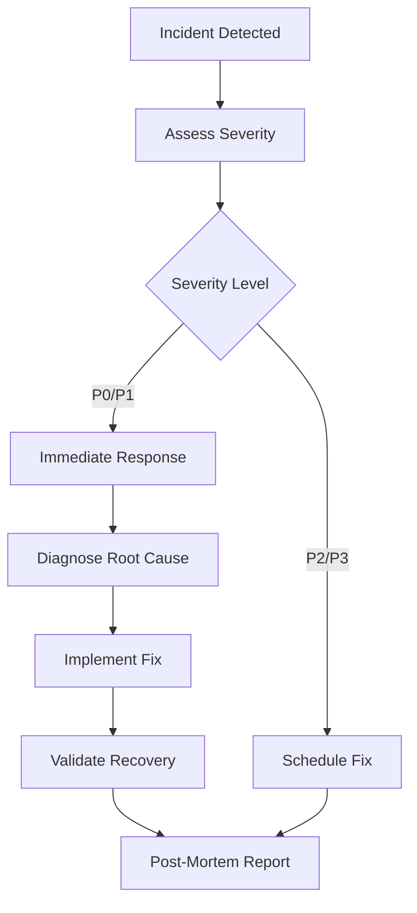

# 🚨 Disaster Recovery Plan

**Advancia Payledger - Business Continuity & Disaster Recovery**

**Author:** mucha  
**Repository:** https://github.com/muchaeljohn739337-cloud/modular-saas-platform  
**License:** PRIVATE  
**Last Updated:** 2024-01-15

---

## 📋 Table of Contents

1. [Overview](#overview)
2. [Risk Assessment](#risk-assessment)
3. [Backup Strategy](#backup-strategy)
4. [Recovery Procedures](#recovery-procedures)
5. [Emergency Contacts](#emergency-contacts)
6. [Testing & Validation](#testing--validation)
7. [Incident Response](#incident-response)

---

## 🎯 Overview

### Purpose

This document outlines procedures for recovering Advancia Payledger services in the event of:

- Data loss or corruption
- Service outages
- Security breaches
- Infrastructure failures
- Natural disasters

### Recovery Objectives

| Metric                             | Target   | Maximum    |
| ---------------------------------- | -------- | ---------- |
| **RTO** (Recovery Time Objective)  | 4 hours  | 24 hours   |
| **RPO** (Recovery Point Objective) | 1 hour   | 24 hours   |
| **Data Loss Tolerance**            | < 1 hour | < 24 hours |
| **Service Availability**           | 99.9%    | 99%        |

---

## ⚠️ Risk Assessment

### Critical Risks

#### 1. Database Failure

**Impact:** Complete data loss, service unavailable  
**Probability:** Low  
**Mitigation:** Daily backups, read replicas, point-in-time recovery

#### 2. Backend Server Outage

**Impact:** Service unavailable, user transactions blocked  
**Probability:** Medium  
**Mitigation:** Auto-scaling, health checks, multi-region deployment

#### 3. Frontend Deployment Failure

**Impact:** User interface unavailable  
**Probability:** Low  
**Mitigation:** Vercel automatic rollback, CDN caching

#### 4. Payment Gateway Failure (Stripe)

**Impact:** Payment processing blocked  
**Probability:** Very Low  
**Mitigation:** Webhook retry logic, manual reconciliation

#### 5. Data Breach / Security Incident

**Impact:** Data exposure, regulatory penalties  
**Probability:** Low  
**Mitigation:** Encryption, access controls, audit logging

#### 6. Third-Party Service Failures

**Impact:** Email, SMS, crypto operations unavailable  
**Probability:** Medium  
**Mitigation:** Fallback services, retry queues

---

## 💾 Backup Strategy

### Automated Backups

#### Database Backups

```powershell
# Daily full backups at 2 AM
.\scripts\Automated-Database-Backup.ps1

# Backup schedule:
# - Full backup: Daily at 2:00 AM UTC
# - Incremental backup: Every 6 hours
# - Retention: 30 days
# - Storage: C:\ADVANCIA-SHARED\backups\database
```

**Location:** `C:\ADVANCIA-SHARED\backups\database\`  
**Format:** PostgreSQL custom format (`.sql` compressed)  
**Encryption:** AES-256 (optional)  
**Retention:** 30 days (configurable)

#### Code Repository Backups

```bash
# GitHub repository (private)
git push origin main

# Manual archive
git archive --format=zip --output=advancia-$(date +%Y%m%d).zip HEAD
```

**Primary:** GitHub (muchaeljohn739337-cloud/modular-saas-platform)  
**Backup:** Local clones on secure machines  
**Frequency:** Every commit

#### Configuration Backups

- `.env` files (encrypted): `backend/.env.enc.json`
- Secrets management: GitHub Secrets, Render environment variables
- Infrastructure as Code: Deployment scripts in `scripts/`

### Backup Verification

Run monthly backup verification:

```powershell
# Test database restoration
cd backend
pg_restore --verbose --clean --no-acl --no-owner \
  -h localhost -U postgres -d advancia_test \
  C:\ADVANCIA-SHARED\backups\database\latest.sql

# Verify data integrity
npm run test:db-integrity
```

---

## 🔧 Recovery Procedures

### Scenario 1: Complete Database Loss

**Symptoms:**

- Database connection errors
- Data queries failing
- Backend unable to start

**Recovery Steps:**

1. **Confirm database is unavailable:**

   ```bash
   psql -h $DB_HOST -U $DB_USER -d $DB_NAME
   ```

2. **Identify most recent backup:**

   ```powershell
   Get-ChildItem C:\ADVANCIA-SHARED\backups\database |
     Sort-Object LastWriteTime -Descending |
     Select-Object -First 1
   ```

3. **Restore database from backup:**

   ```bash
   # Stop backend services
   Render: Go to dashboard → Stop service

   # Restore database (Render PostgreSQL)
   # 1. Create new database if needed
   # 2. Use pg_restore from backup file

   pg_restore --verbose --clean --no-acl --no-owner \
     -h $DB_HOST -U $DB_USER -d $DB_NAME \
     C:\ADVANCIA-SHARED\backups\database\advancia-full-2024-01-15.sql
   ```

4. **Verify data integrity:**

   ```bash
   cd backend
   npx prisma migrate status
   npx prisma db push --accept-data-loss
   ```

5. **Restart backend services:**

   ```bash
   # Render: Go to dashboard → Deploy latest commit
   # Or manual deploy:
   git push origin main
   ```

6. **Validate restoration:**

   ```bash
   # Health check
   curl https://api.advanciapayledger.com/api/health

   # Test critical endpoints
   npm run test:integration
   ```

**Expected Recovery Time:** 2-4 hours

---

### Scenario 2: Backend Service Outage

**Symptoms:**

- Frontend unable to connect to API
- 503 Service Unavailable errors
- Health check failing

**Recovery Steps:**

1. **Check service status:**

   ```bash
   # Render dashboard
   # OR
   curl https://api.advanciapayledger.com/api/health
   ```

2. **Review logs:**

   ```bash
   # Render: View logs in dashboard
   # Or stream live logs:
   .\scripts\monitor-production.ps1
   ```

3. **Identify root cause:**

   - Check for deployment errors
   - Review error logs
   - Check resource utilization (CPU, memory)

4. **Recovery actions:**

   **If deployment error:**

   ```bash
   # Rollback to previous version
   Render: Dashboard → Rollback to previous deploy
   ```

   **If resource exhaustion:**

   ```bash
   # Scale up instance
   Render: Dashboard → Settings → Instance type → Upgrade
   ```

   **If code bug:**

   ```bash
   # Revert to last working commit
   git revert HEAD
   git push origin main
   ```

5. **Validate recovery:**
   ```bash
   curl https://api.advanciapayledger.com/api/health
   ```

**Expected Recovery Time:** 15 minutes - 2 hours

---

### Scenario 3: Frontend Deployment Failure

**Symptoms:**

- Website shows old version
- 404 errors
- Build failures

**Recovery Steps:**

1. **Check Vercel deployment status:**

   ```bash
   npx vercel inspect
   ```

2. **Review build logs:**

   ```bash
   # Vercel dashboard → Deployments → View logs
   ```

3. **Recovery actions:**

   **If build error:**

   ```bash
   # Fix build locally first
   cd frontend
   npm run build

   # Then redeploy
   npx vercel --prod
   ```

   **If deployment corruption:**

   ```bash
   # Rollback to previous deployment
   Vercel: Dashboard → Previous deployment → Promote to Production
   ```

4. **Validate recovery:**
   ```bash
   curl https://advanciapayledger.com
   ```

**Expected Recovery Time:** 5-30 minutes

---

### Scenario 4: Data Corruption

**Symptoms:**

- Invalid data in database
- Constraint violations
- Data inconsistencies

**Recovery Steps:**

1. **Identify corruption scope:**

   ```sql
   -- Check for orphaned records
   SELECT * FROM "Transaction"
   WHERE "userId" NOT IN (SELECT id FROM "User");

   -- Check for invalid data
   SELECT * FROM "User" WHERE email IS NULL;
   ```

2. **Stop write operations:**

   ```bash
   # Set application to read-only mode
   # Update environment variable: READ_ONLY_MODE=true
   Render: Dashboard → Environment → Add READ_ONLY_MODE=true
   ```

3. **Restore from backup (if severe):**

   ```bash
   # Use point-in-time recovery
   pg_restore --verbose \
     --clean --no-acl --no-owner \
     -h $DB_HOST -U $DB_USER -d $DB_NAME \
     backup-before-corruption.sql
   ```

4. **Manual data repair (if minor):**

   ```sql
   -- Fix specific records
   UPDATE "Transaction"
   SET status = 'failed'
   WHERE status IS NULL;

   -- Remove orphaned records
   DELETE FROM "Transaction"
   WHERE "userId" NOT IN (SELECT id FROM "User");
   ```

5. **Re-enable write operations:**
   ```bash
   Render: Dashboard → Environment → Remove READ_ONLY_MODE
   ```

**Expected Recovery Time:** 1-6 hours

---

### Scenario 5: Security Breach

**Symptoms:**

- Unauthorized access detected
- Unusual activity in logs
- Security alerts from surveillance AI

**Recovery Steps:**

1. **Immediate containment:**

   ```bash
   # Revoke all JWT tokens
   cd backend
   node -e "process.env.JWT_SECRET='NEW_SECRET_$(date +%s)'"

   # Update JWT_SECRET in Render environment variables
   Render: Dashboard → Environment → Update JWT_SECRET

   # Force all users to re-login
   ```

2. **Identify breach scope:**

   ```sql
   -- Check audit logs
   SELECT * FROM "AuditLog"
   WHERE timestamp > NOW() - INTERVAL '24 hours'
   ORDER BY timestamp DESC;

   -- Identify compromised accounts
   SELECT * FROM "User"
   WHERE lastLogin > NOW() - INTERVAL '24 hours';
   ```

3. **Secure the system:**

   ```bash
   # Update all secrets
   - JWT_SECRET
   - API_KEY
   - ADMIN_KEY
   - DATABASE_URL password
   - Stripe webhook secret

   # Reset all user passwords
   UPDATE "User" SET password = NULL, requirePasswordReset = true;
   ```

4. **Notify affected users:**

   ```bash
   # Send security notification emails
   cd backend
   npm run send-security-alert
   ```

5. **Forensic analysis:**

   - Review all logs from past 7 days
   - Identify attack vector
   - Document findings
   - Report to authorities if needed

6. **Harden security:**
   - Apply security patches
   - Update dependencies
   - Increase monitoring
   - Review access controls

**Expected Recovery Time:** 4-24 hours

---

## 📞 Emergency Contacts

### Primary Contact

**Name:** mucha  
**Role:** Owner & Lead Developer  
**Email:** muchaeljohn739337@users.noreply.github.com  
**Availability:** 24/7

### Service Providers

#### Hosting

**Render (Backend)**  
Support: support@render.com  
Dashboard: https://dashboard.render.com  
Status: https://status.render.com

**Vercel (Frontend)**  
Support: support@vercel.com  
Dashboard: https://vercel.com/dashboard  
Status: https://www.vercel-status.com

#### Database

**Render PostgreSQL**  
Managed via Render dashboard  
Automatic backups: Daily

#### Payment Processing

**Stripe**  
Support: https://support.stripe.com  
Dashboard: https://dashboard.stripe.com  
Status: https://status.stripe.com

#### Email Service

**Gmail SMTP**  
App passwords: https://myaccount.google.com/apppasswords

---

## ✅ Testing & Validation

### Monthly Disaster Recovery Drill

Schedule: **First Sunday of every month**

**Test Scenarios:**

1. Restore database from backup
2. Deploy emergency hotfix
3. Rollback deployment
4. Simulate security incident response

**Checklist:**

```
[ ] Database backup restoration (< 4 hours)
[ ] Backend service recovery (< 2 hours)
[ ] Frontend deployment rollback (< 30 minutes)
[ ] Emergency notification system test
[ ] Contact list verification
[ ] Documentation review and update
```

### Validation Script

```powershell
# Run monthly DR validation
.\scripts\Disaster-Recovery-Test.ps1

# Expected output:
# ✅ Database backup verified
# ✅ Backup restoration tested
# ✅ Service rollback tested
# ✅ Emergency contacts verified
# ✅ Documentation up-to-date
```

---

## 🚨 Incident Response

### Incident Severity Levels

| Level             | Description               | Response Time        | Examples                       |
| ----------------- | ------------------------- | -------------------- | ------------------------------ |
| **P0 - Critical** | Complete service outage   | Immediate (< 15 min) | Database down, security breach |
| **P1 - High**     | Major feature unavailable | < 1 hour             | Payment processing down        |
| **P2 - Medium**   | Minor feature degradation | < 4 hours            | Email delays, slow API         |
| **P3 - Low**      | Cosmetic issues           | < 24 hours           | UI bugs, typos                 |

### Incident Workflow



### Post-Incident Report Template

```markdown
# Incident Report: [Title]

**Date:** [YYYY-MM-DD]
**Severity:** P0/P1/P2/P3
**Duration:** [X hours]
**Impact:** [Number of users affected]

## Timeline

- HH:MM - Incident detected
- HH:MM - Response team notified
- HH:MM - Root cause identified
- HH:MM - Fix deployed
- HH:MM - Service restored

## Root Cause

[Detailed analysis]

## Resolution

[Actions taken]

## Prevention

[Future measures to prevent recurrence]

## Lessons Learned

[Key takeaways]
```

---

## 📚 Additional Resources

- **Deployment Guide:** `.github/copilot-deployment-instructions.md`
- **Architecture Documentation:** `AI_SYSTEM_ARCHITECTURE.md`
- **API Documentation:** `API_DOCUMENTATION.md`
- **Backup Script:** `scripts/Automated-Database-Backup.ps1`
- **Monitoring Dashboard:** `frontend/src/app/admin/monitoring/page.tsx`

---

## 🔄 Document Maintenance

**Review Frequency:** Monthly  
**Next Review:** 2024-02-15  
**Approval:** mucha (Owner)

**Change Log:**

- 2024-01-15: Initial version
- [Future updates here]

---

**END OF DISASTER RECOVERY PLAN**

_This document is PRIVATE and CONFIDENTIAL. Do not distribute without authorization._
