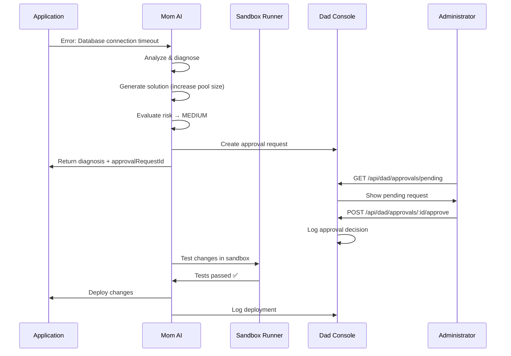

# Dad Admin Console - Complete Guide

## Overview

**Dad Admin Console** is the human oversight layer in the Mom-Shield-Dad architecture. It provides administrators with:

- **Approval workflows** for AI-proposed changes
- **Emergency controls** (kill-switch, emergency unfreeze)
- **Rollback capabilities** for deployed changes
- **Incident review** interface
- **Audit trail** for all approval decisions
- **RBAC enforcement** based on risk levels

## Architecture

```
┌─────────────────────────────────────────────────────────┐
│                    Mom-Shield-Dad                        │
├─────────────────────────────────────────────────────────┤
│                                                          │
│  ┌──────────┐      ┌───────────┐      ┌──────────┐    │
│  │   Mom    │─────▶│  SHIELD   │─────▶│   SIEM   │    │
│  │  (AI)    │      │ (Protect) │      │ (Detect) │    │
│  └──────────┘      └───────────┘      └──────────┘    │
│       │                                       │         │
│       │                                       │         │
│       ▼                                       ▼         │
│  ┌──────────┐                           ┌──────────┐  │
│  │ Sandbox  │◀──────────────────────────│   Dad    │  │
│  │  (Test)  │                           │ (Oversee)│  │
│  └──────────┘                           └──────────┘  │
│                                                          │
└─────────────────────────────────────────────────────────┘
```

## API Endpoints

### 1. Approval Management

#### Create Approval Request

```bash
POST /api/dad/approvals/create
Authorization: Bearer <token>

Body:
{
  "type": "code_change" | "config_change" | "deployment" | "emergency_action",
  "riskLevel": "LOW" | "MEDIUM" | "HIGH" | "EMERGENCY",
  "title": "Fix database connection timeout",
  "description": "Increase connection pool size from 10 to 20",
  "proposedChanges": {
    "files": [
      {
        "path": "config/database.ts",
        "changes": "connection_pool: 20"
      }
    ]
  },
  "metadata": {
    "requestedBy": "mom_ai",
    "incidentId": "INC-12345"
  }
}

Response:
{
  "success": true,
  "requestId": "approval_1234567890_abc123",
  "approvalRequest": {
    "id": "approval_1234567890_abc123",
    "status": "pending",
    "approvalsRequired": 1,
    "approvalsReceived": 0
  }
}
```

#### Get Pending Approvals

```bash
GET /api/dad/approvals/pending
Authorization: Bearer <token>
Admin: Required

Response:
{
  "success": true,
  "count": 3,
  "approvals": [
    {
      "id": "approval_1234567890_abc123",
      "type": "code_change",
      "riskLevel": "MEDIUM",
      "title": "Fix database connection timeout",
      "requestedBy": "mom_ai",
      "requestedAt": "2025-06-01T10:30:00Z",
      "status": "pending",
      "approvalsRequired": 1
    }
  ]
}
```

#### Approve Request

```bash
POST /api/dad/approvals/:id/approve
Authorization: Bearer <token>
Admin: Required

Body:
{
  "reason": "Reviewed and validated the changes"
}

Response:
{
  "success": true,
  "message": "Approval granted",
  "requestId": "approval_1234567890_abc123"
}
```

#### Reject Request

```bash
POST /api/dad/approvals/:id/reject
Authorization: Bearer <token>
Admin: Required

Body:
{
  "reason": "Changes may impact critical services"
}

Response:
{
  "success": true,
  "message": "Approval rejected",
  "requestId": "approval_1234567890_abc123",
  "reason": "Changes may impact critical services"
}
```

### 2. Emergency Controls

#### Activate Kill-Switch

```bash
POST /api/dad/kill-switch
Authorization: Bearer <token>
Admin: Required

Body:
{
  "reason": "Multiple critical incidents detected",
  "scope": "all" | "mom_ai" | "sandbox" | "deployments"
}

Response:
{
  "success": true,
  "message": "Kill-switch activated - All AI operations stopped",
  "killSwitchId": "killswitch_1234567890",
  "timestamp": "2025-06-01T10:45:00Z"
}
```

**Effects of Kill-Switch:**

1. ❌ Stops all Mom AI incident handling
2. ❌ Cancels all sandbox jobs
3. ❌ Pauses all automated deployments
4. 🚨 Sends emergency alerts to admins
5. 📝 Logs activation in audit trail

#### Deactivate Kill-Switch

```bash
POST /api/dad/kill-switch/deactivate
Authorization: Bearer <token>
Admin: Required

Body:
{
  "reason": "Issues resolved, resuming normal operations"
}

Response:
{
  "success": true,
  "message": "Kill-switch deactivated - AI operations resumed"
}
```

### 3. Rollback Management

#### Rollback Deployment

```bash
POST /api/dad/rollback/:id
Authorization: Bearer <token>
Admin: Required

Body:
{
  "reason": "Deployment caused performance degradation"
}

Response:
{
  "success": true,
  "message": "Rollback initiated",
  "rollbackId": "rollback_1234567890_abc123",
  "originalDeploymentId": "deployment_1234567890_xyz789"
}
```

### 4. Incident Review

#### Get Security Incidents

```bash
GET /api/dad/incidents?status=all&severity=HIGH&limit=50
Authorization: Bearer <token>
Admin: Required

Query Parameters:
- status: "all" | "open" | "investigating" | "resolved" | "closed"
- severity: "INFO" | "WARN" | "ERROR" | "CRITICAL"
- limit: number (default: 50)

Response:
{
  "success": true,
  "count": 12,
  "incidents": [
    {
      "id": "incident_1234567890",
      "action": "incident_created",
      "severity": "HIGH",
      "timestamp": "2025-06-01T10:00:00Z",
      "metadata": {
        "status": "investigating",
        "description": "Suspicious API activity detected"
      }
    }
  ]
}
```

### 5. Audit Trail

#### Get Audit Logs

```bash
GET /api/dad/audit?limit=100&offset=0&action=APPROVAL_GRANTED
Authorization: Bearer <token>
Admin: Required

Query Parameters:
- limit: number (default: 100)
- offset: number (default: 0)
- action: string (optional filter)

Response:
{
  "success": true,
  "total": 250,
  "count": 100,
  "logs": [
    {
      "id": "approval_1234567890",
      "action": "APPROVAL_GRANTED",
      "userId": "admin@example.com",
      "timestamp": "2025-06-01T11:00:00Z",
      "resourceType": "APPROVAL_REQUEST",
      "resourceId": "approval_1234567890_abc123",
      "changes": "{\"decision\":\"approve\"}",
      "ipAddress": "192.168.1.100",
      "severity": "INFO"
    }
  ]
}
```

### 6. Health Check

```bash
GET /api/dad/health

Response:
{
  "status": "ok",
  "service": "Dad Admin Console",
  "timestamp": "2025-06-01T12:00:00Z"
}
```

## Risk Levels & Approval Requirements

Based on `config/ai-policies/approval_policy.yaml`:

| Risk Level    | Approvals | Approver Roles | 2FA | Sandbox | Delay  | Auto-Apply |
| ------------- | --------- | -------------- | --- | ------- | ------ | ---------- |
| **LOW**       | 0         | N/A            | ❌  | ❌      | None   | ✅         |
| **MEDIUM**    | 1         | admin, ops     | ❌  | ✅      | None   | ❌         |
| **HIGH**      | 2         | admin only     | ✅  | ✅      | 1 hour | ❌         |
| **EMERGENCY** | 2         | admin only     | ✅  | ❌      | None   | ❌         |

## RBAC (Role-Based Access Control)

### Admin Role

**Full permissions:**

- ✅ Approve LOW, MEDIUM, HIGH, EMERGENCY requests
- ✅ Activate/deactivate kill-switch
- ✅ Trigger rollbacks
- ✅ Emergency unfreeze (override HIGH delays)
- ✅ View all incidents and audit logs

### Ops Role

**Limited permissions:**

- ✅ Approve LOW, MEDIUM requests
- ❌ Cannot approve HIGH or EMERGENCY
- ✅ View incidents (read-only)
- ❌ Cannot activate kill-switch
- ❌ Cannot trigger rollbacks

### Viewer Role

**Read-only:**

- ✅ View incidents
- ✅ View audit logs
- ❌ Cannot approve anything
- ❌ No write operations

## Integration with Mom AI

When Mom AI detects an incident and proposes a solution:

1. **Mom analyzes incident** → Generates diagnosis and solution
2. **Decision agent evaluates risk** → Determines if approval needed
3. **If requiresApproval = true:**
   - Creates approval request in Dad Console
   - Returns `approvalRequestId` in response
   - Waits for human decision
4. **Admin reviews in Dad Console:**
   - Views proposed changes
   - Checks sandbox results
   - Approves or rejects
5. **If approved:**
   - Mom AI proceeds with implementation
   - Logs outcome
6. **If rejected:**
   - Mom AI marks as rejected
   - Learns from feedback

## Workflow Example

### Scenario: Database Connection Timeout



## Audit Actions

All Dad Console actions are logged:

- `APPROVAL_REQUEST_CREATED` - New approval request
- `APPROVAL_GRANTED` - Request approved
- `APPROVAL_REJECTED` - Request rejected
- `KILL_SWITCH_ACTIVATED` - Emergency stop activated
- `KILL_SWITCH_DEACTIVATED` - Normal operations resumed
- `ROLLBACK_INITIATED` - Deployment rolled back

## Best Practices

### For Administrators

1. **Review context before approving:**
   - Check Mom AI's diagnosis confidence
   - Review proposed code/config changes
   - Verify sandbox test results
   - Consider impact on production

2. **Use appropriate risk levels:**
   - LOW: Minor config tweaks, logging changes
   - MEDIUM: Database settings, non-critical features
   - HIGH: Core business logic, authentication, payment systems
   - EMERGENCY: Security patches, critical outages

3. **Provide clear rejection reasons:**
   - Helps Mom AI learn from feedback
   - Documents decision rationale
   - Enables better future proposals

4. **Monitor audit trail:**
   - Regular review of approval patterns
   - Identify trends in AI proposals
   - Validate RBAC enforcement

### For Operators

1. **Escalate HIGH/EMERGENCY to admins:**
   - Ops cannot approve HIGH or EMERGENCY
   - Ensure admins are notified
   - Provide context from monitoring

2. **Use kill-switch sparingly:**
   - Only for genuine emergencies
   - Document reason thoroughly
   - Coordinate with team before deactivating

3. **Track sandbox results:**
   - Verify all MEDIUM/HIGH pass sandbox
   - Report sandbox failures
   - Request improvements to test coverage

## Security Considerations

1. **IP Whitelisting:**
   - Dad Console routes protected by `ipWhitelistMiddleware`
   - Only approved IPs can access

2. **Authentication:**
   - All endpoints require valid JWT token
   - Most require admin role

3. **2FA Requirement:**
   - HIGH and EMERGENCY approvals require 2FA
   - Enforced at approval time

4. **Audit Logging:**
   - Every action logged with:
     - User ID
     - IP address
     - User agent
     - Timestamp
     - Changes made

5. **Rate Limiting:**
   - Kill-switch actions rate-limited
   - Prevents abuse

## Monitoring & Alerts

### Dashboard Metrics

- **Pending Approvals:** Count of requests awaiting review
- **Approval Rate:** % of approved vs rejected
- **Average Review Time:** Time from request to decision
- **Kill-Switch Activations:** Count and reasons
- **Rollback Count:** Number of rollbacks executed

### Alerts

- 🚨 **Kill-switch activated** → Notify all admins immediately
- ⚠️ **HIGH risk approval pending** → Notify admins within 5 minutes
- 📊 **>10 pending approvals** → Notify ops team
- 🔄 **Rollback initiated** → Notify development team

## Troubleshooting

### Common Issues

**1. Approval request not appearing:**

- Check Mom AI logs for request creation
- Verify `requiresApproval` flag in decision
- Check database `audit_logs` table

**2. Cannot approve HIGH risk:**

- Verify user has admin role
- Check RBAC configuration
- Ensure 2FA is enabled

**3. Kill-switch not taking effect:**

- Check Mom AI is monitoring kill-switch state
- Verify all services check kill-switch before actions
- Review audit logs for activation confirmation

## Next Steps

After completing Dad Console implementation:

1. ✅ **Test complete workflow:**
   - Mom detects incident
   - Creates approval request
   - Admin approves via Dad Console
   - Sandbox tests changes
   - Changes deployed
   - Outcome logged

2. ✅ **Add dashboard UI:**
   - Frontend for Dad Console
   - Real-time approval notifications
   - Visual incident review

3. ✅ **Enhance analytics:**
   - Approval decision patterns
   - AI proposal success rate
   - Risk distribution analysis

## Summary

Dad Admin Console completes the Mom-Shield-Dad architecture by providing:

- ✅ Human oversight for AI decisions
- ✅ Emergency controls for critical situations
- ✅ Rollback capabilities for safe operations
- ✅ Comprehensive audit trail
- ✅ RBAC enforcement based on risk levels

The system now has **autonomous incident handling (Mom)**, **real-time protection (SHIELD)**, **threat correlation
(SIEM)**, **safe testing (Sandbox)**, and **human oversight (Dad)** - a complete security and incident response system.
